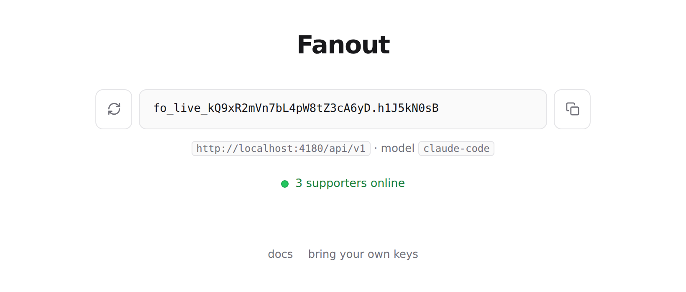
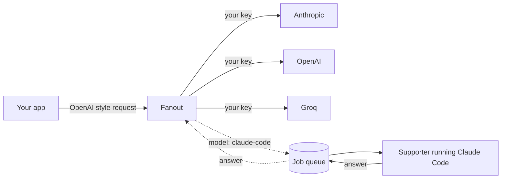

# Fanout

One API endpoint that talks to Anthropic, OpenAI, and Groq. You bring your own keys, or you let a supporter answer for you. It speaks the OpenAI format, so tools you already use just work.



Live at https://fanout-tawny.vercel.app

## What it is

Fanout is a small proxy. You point any OpenAI compatible app at it, and it forwards your chat requests to a real provider. There is no signup and no database. Your key is a signed token, and your provider credentials are encrypted and handed back to you to keep.

There are two ways to get an answer:

1. Bring your own provider keys. Add one or more, and Fanout pools them and fails over when one is busy or dead.
2. Use the `claude-code` model. Your request goes to a supporter who is running Claude Code on their own machine, and their answer comes back to you. You do not need a provider key for this.

## Get started in 30 seconds

Open the site. A key is made for you the moment the page loads. Copy it, add a provider key if you want to use your own, and copy the config block into your app.

From code it is three lines of setup. Any OpenAI client works:

```js
import OpenAI from 'openai'

const fanout = new OpenAI({
  baseURL: 'https://fanout-tawny.vercel.app/api/v1',
  apiKey: process.env.FANOUT_KEY,
  defaultHeaders: { 'X-Fanout-Connection': process.env.FANOUT_CONNECTIONS },
})

const res = await fanout.chat.completions.create({
  model: 'anthropic/claude-opus-5',
  messages: [{ role: 'user', content: 'hi' }],
})
```

Models are named `provider/model`, like `anthropic/claude-opus-5`, `openai/gpt-4o`, or `groq/llama-3.3-70b-versatile`. Use `claude-code` to go through the supporter relay instead.

## Become a supporter

You can answer other people's `claude-code` requests from your own machine. Open the site and switch to "Become a supporter" in the top right. You get a short brief with your key already filled in. Paste it into Claude Code or Codex and leave it running. Your machine then loops:

1. It long-polls `POST /api/work/next` for the next job.
2. It answers the conversation in the job's messages itself.
3. It sends the answer back with `POST /api/work/complete`, then polls again.

It keeps going until you stop it. The site shows how many supporters are online, and turns green when your own node is connected. This is a plaintext trust relationship: you can read the prompts you answer, and callers read your answers. The site says so where you turn it on.

## How it works



Two ideas keep it simple:

- Your Fanout key is a signed token. Checking it is one hash, so there is no user table and no lookup.
- Your provider key is sealed into an encrypted blob that only your key can open. Fanout keeps no copy, so there is nothing on the server to leak.

## Endpoints

| Method | Path | What it does |
| --- | --- | --- |
| POST | `/api/keys/issue` | Make a Fanout key |
| POST | `/api/connect` | Seal a provider key into a blob you keep |
| POST | `/api/v1/chat/completions` | The proxy, OpenAI compatible, streaming supported |
| GET | `/api/v1/models` | List providers |
| POST | `/api/work/next` | Supporter: ask for the next job |
| POST | `/api/work/complete` | Supporter: send back an answer |
| GET | `/api/work/status` | Is a supporter online, and how many |
| GET | `/api/health` | Liveness |

## Honest limits

- A supporter can read the prompts they answer, and you can read their answer. The relay is a trust relationship, and the site says so where you turn it on.
- The relay uses an in memory queue unless Upstash is set, so on the free tier a caller and a supporter only meet if they land on the same server. Set `UPSTASH_REDIS_REST_URL` and `UPSTASH_REDIS_REST_TOKEN` to make it work everywhere.
- A lost key cannot be shown again. The site has a backup button for this reason.
- This is a demo. The free hosting tier is not for commercial use.

## Local development

```bash
npm install
npm run check   # typecheck and the smoke test suite
```

There are no runtime dependencies. Everything runs on the edge with plain fetch and WebCrypto.
