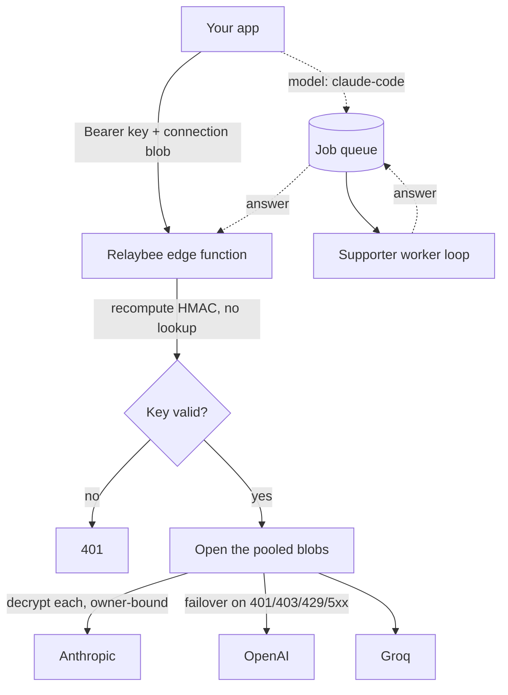

# Architecture

Relaybee is one OpenAI-shaped endpoint with no database on the request path. This
is a short tour of the four pieces that make that work.

## Stateless HMAC key

A Relaybee key is not a row in a table. It is a small payload (a user id, a tier,
an expiry) plus an HMAC signature over that payload, computed with a server-held
master secret. The key carries everything it asserts about itself.

Checking a key is one recompute. The server re-signs the payload and compares it
to the signature the key already carries. If they match, the key is genuine and
unexpired; if they do not, it is rejected. There is no user table, no lookup, and
no read of any shared state. Minting is free and unauthenticated because a key
grants nothing on its own. It routes traffic only once a sealed provider key
rides along with it.

The cost of this is honest: a key stays valid until it expires, because there is
nowhere to write a revocation. That tradeoff is deliberate and recorded in
PROJECT.md.

## AES-GCM sealed connection, bound to the owner

Your provider credential never rests on the server. When you connect a provider
key, Relaybee encrypts it with AES-256-GCM under a master encryption key and hands
the sealed blob back to you. Your browser keeps it. Relaybee keeps no copy, so
there is nothing on the server to leak.

The seal binds the blob to you. Your Relaybee user id goes in as the AES-GCM
additional authenticated data, so decryption only succeeds when the same owner
presents the blob. A blob scraped from someone else's browser fails to open and
cannot spend their credits. This owner-binding is security-reviewed and is never
to be removed.

## Pooling proxy with failover

You can attach more than one sealed blob to a single request. Relaybee treats them
as a pool. It opens each blob, tries the provider, and on a retryable failure
(401, 403, 429, or a 5xx) walks on to the next one. The first working provider
answers.

The walk starts at a random offset rather than at the first blob, so traffic
spreads across the pool instead of hammering whichever key sits at index zero.
The pool is capped at eight blobs, which bounds how many upstream calls one
request can trigger. Every response carries a health header reporting each
attempt's outcome in walk order, so you can see which key answered and which
were skipped.

## Supporter relay: queue plus worker

The `claude-code` model does not go to a provider. It goes to a person.

A `claude-code` request submits a job to a queue and waits, up to a bounded
window, for an answer. On the other side, a supporter runs a small worker loop
on their own machine: it long-polls for the next job, answers the conversation,
posts the answer back, and polls again. The queued answer flows back to the
waiting caller, shaped like an ordinary OpenAI completion.

The queue is the only stateful piece in the system. It uses Upstash Redis when
those environment variables are set, and a per-instance in-memory map otherwise.
Jobs carry only the model and the flattened messages, never the requester's id
or IP; the job's UUID is the capability that lets a worker return an answer.

The relay is a disclosed plaintext-trust relationship. Supporters can read the
prompts they answer, and callers can read the answers that come back. The site
says so where a supporter turns it on, and we do not pretend otherwise.
